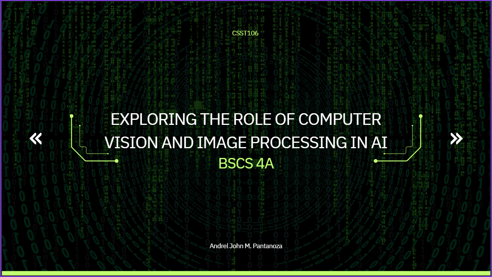

# Exploring the Role of Computer Vision and Image Processing in AI

## Overview
This project explores the critical role of **computer vision** and **image processing** in Artificial Intelligence (AI). It covers essential image processing techniques, case studies, and practical implementations that demonstrate how AI systems interpret and analyze visual data.

## Objective
The objective of this project is to:
- Understand the importance of image processing in AI.
- Explore various image processing techniques such as filtering, edge detection, and segmentation.
- Discuss real-world applications like **autonomous vehicles** that utilize these techniques.
- Implement a simple image processing model to demonstrate its use in AI.

## Contents
1. **Presentation**: A PowerPoint presentation that provides an introduction to computer vision and image processing techniques in AI.
2. **Video**: A video walkthrough of the presentation is available for preview.
3. **Colab Implementation**: A practical demonstration of image processing using Python on Google Colab.

## Image Processing Implementation
You can explore the implementation of image processing techniques, such as edge detection and segmentation, through this interactive Google Colab notebook:

In this notebook, you will find:
- **Edge Detection**: The Canny edge detection algorithm applied to a sample image to identify the boundaries and edges of objects within the image.
- **Image Segmentation**: Techniques to segment an image into different regions, making it easier to identify specific objects or areas of interest.
- **Filtering**: A demonstration of noise reduction using filters to enhance image quality and improve feature extraction.

### Explanation:
The Colab notebook provides a step-by-step demonstration of basic image processing techniques. By running the code, you can experiment with applying filters, detecting edges, and segmenting images. These processes are critical in enabling AI systems to interpret visual data more effectively. The notebook includes both the code and explanations for how these techniques are implemented and how they contribute to solving real-world visual problems.

## Video Preview

*Click the image above to watch the video presentation.*

## Key Topics Covered
- **Computer Vision and AI**: How AI systems process and interpret visual data from the world.
- **Image Processing Techniques**:
  - Filtering (Noise reduction, enhancement)
  - Edge Detection (Identifying object boundaries)
  - Segmentation (Dividing an image into meaningful parts)
- **Case Study: Autonomous Vehicles**:
  - Use of image processing for lane detection, obstacle identification, and decision-making in real-time.
- **Emerging Technique: Deep Learning-Based Image Analysis**:
  - The role of deep learning, especially Convolutional Neural Networks (CNNs), in transforming image processing in AI.

## How to View the Presentation
- You can download the **PowerPoint Presentation** from this repository.
- Click on the image above to watch the **video walkthrough** of the presentation.

# Image Processing with OpenCV

## Introduction

In this repository, we explore various image processing techniques using OpenCV, a powerful library for computer vision. This script allows you to perform a range of operations on images, from basic transformations to advanced filtering and edge detection. Below, we provide an overview of the capabilities demonstrated:

### Image Display

We start by providing functions to display images using matplotlib. These functions allow you to visualize single images or compare two images side by side.

### Image Upload and Conversion

You can upload an image from Google Colab and convert it into a format suitable for OpenCV processing. This step is essential for performing subsequent image manipulations.

### Basic Image Transformations

- **Scaling**: Adjust the size of the image by a specified factor.
- **Rotation**: Rotate the image by a given angle.

### Blurring Techniques

- **Gaussian Blur**: Smoothens the image to reduce noise and detail.
- **Median Blur**: Applies median filtering to remove salt-and-pepper noise.
- **Bilateral Filter**: Reduces noise while preserving edges, making it ideal for noise reduction without losing detail.
- **Box Filter**: Averages pixel values within a specified kernel size for smoothing.
- **Motion Blur**: Simulates the effect of motion blur by applying a linear kernel.

### Edge Detection

- **Canny Edge Detection**: Identifies edges in an image by detecting areas of rapid intensity change.
- **Sobel Edge Detection**: Uses the Sobel operator to detect edges by computing gradient magnitudes.
- **Laplacian Edge Detection**: Finds edges by applying the Laplacian operator, which highlights areas of rapid intensity change.
- **Prewitt Edge Detection**: Utilizes the Prewitt operator to detect edges in the x and y directions.

### Sharpening

- **Unsharp Masking**: Enhances image sharpness by subtracting a blurred version from the original image.

### Interactive Processing

Users can interactively choose an image transformation to apply from a predefined list, including scaling, rotation, various blurring techniques, and edge detection methods.

### Comparison Visualization

The script concludes by displaying the original and processed images for easy comparison, allowing you to assess the effects of each transformation visually.

This script provides a comprehensive toolkit for image processing, making it an invaluable resource for tasks such as image enhancement, noise reduction, and feature extraction.

### Step by Step Process on how to apply this Image Processing techniques

Ipynb notebook file: "https://github.com/PhamHanni/CSST106-CS4A/blob/main/Pantanoza_Exer1_Image_Processing_Techniques.ipynb"

# Image Processing Techniques using OpenCV

## Script Usage
The script performs the following image processing techniques:

- **Scaling**: Resizes the image based on specified scaling factors.
- **Rotation**: Rotates the image by a specified angle.
- **Blurring**: Applies a Gaussian blur to the image to reduce noise.
- **Edge Detection**: Detects edges in the image using the Canny edge detection algorithm.

## How to Run the Script
1. Save the script in a Python file, e.g., `image_processing.py`.
2. Place an image in the same directory or specify the correct path to the image in the code.
3. Run the script using:

